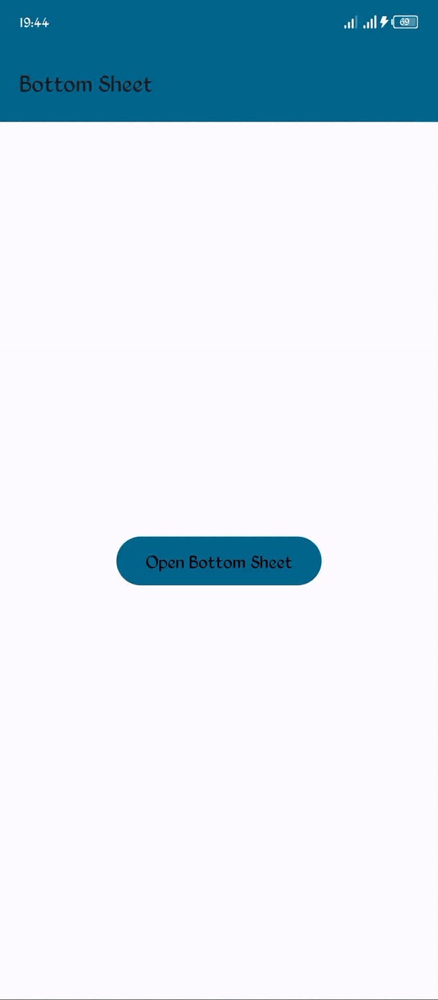
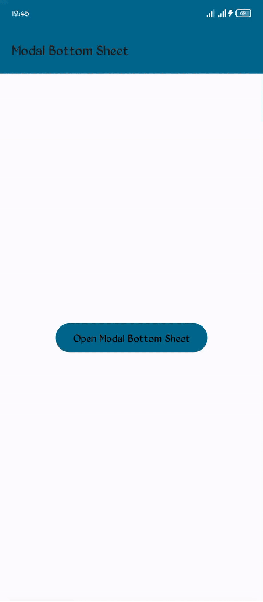

  <h1>Compose Bottom Sheet</h1>
  <h3>Create Bottom sheet and Modal Bottom sheet in jetpack compose</h3>

  
  

  Developed with ❤︎ by<h4><a href="https://github.com/isaacjadrey">Isaac Jadrey</a> 
  
  in Kotlin & Jetpack Compose</h4>

# Components
* [Material](https://material.io/)
* [Material 3](https://m3.material.io/)

# Demo
<table>
<tr>
<td>Bottom Sheet</td>
<td>Modal Bottom Sheet</td>
</tr>
<tr>
<td></td>
<td></td>
</tr>
</table>
